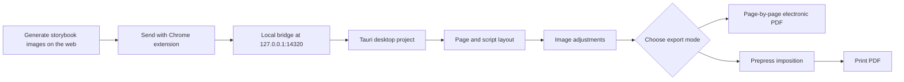

# Storybook Co-Editor

<p align="center">
  <a href="./README.md">简体中文</a> · <strong>English</strong>
</p>

<p align="center">
  
</p>

<p align="center">
  
  
  
  
  
</p>

Storybook Co-Editor is a local collaborative layout tool for AI-generated and web-based storybooks. It connects the workflow from images created in a browser to editable local projects and electronic or print-ready PDFs. The Chrome extension captures illustrations, while the Tauri desktop app handles page ordering, typography, image adjustments, project storage, and prepress imposition.

It is intended for storybooks created with ChatGPT, Gemini, Midjourney, Discord, or other browser-based tools, when the generated images need to become an editable, persistent, and exportable local project.

- Current version: `1.2.0`
- Downloads: [GitLab Releases](https://gitlab.com/glenzli/storybook-co-editor/-/releases)
- Project format: `.scproj`
- Interface languages: English and Simplified Chinese
- Local bridge: `http://127.0.0.1:14320`

## Preview

**Chrome extension: capture images from the page**

Hover over an image on a supported page and send it directly to the local editor. An image can also be marked as a style reference for later alignment.


**Content editor: pages, covers, title pages, body text, and typography**

Manage page order on the left, preview the canvas in the center, and adjust the script, fonts, sizes, colors, strokes, backdrops, and offsets on the right.


**Script editor: bind text to pages with tags**

Maintain the complete book script in one panel. `[Cover]`, `[Author]`, `[Title]`, and numbered page tags map automatically to the corresponding page previews.


**Image adjustments: local processing for individual pages**

Adjust canvas color, background-color removal, scale and offset, exposure, shadows, highlights, saturation, temperature, tint, and selective HSL.


**Prepress imposition: a physical print preview**

Preview single-page or 2-up layouts on A4, A5, or A3 paper, with binding methods, glue margins, printer margins, crop marks, and duplex printing.


## Workflow



## Features

**Web capture**

- Image overlay actions for `Send` and `Reference`.
- Extracts images from the page DOM, lazy-loaded elements, and common AI image URLs.
- Sends images to the desktop app as base64 data or URLs.
- Uses content hashes to avoid importing the same image more than once.

**Local storybook editing**

- Drag to reorder pages, move pages to the beginning or end, delete, restore, copy, and export original images.
- Insert virtual `blank://` pages to complete print signatures.
- Configure independent styles for covers, title pages, body text, and author credits.
- Use English or Chinese script tags: `[Cover]`, `[封面]`, `[Title]`, `[扉页]`, `[Author]`, `[作者]`, `[1]`, and `[2]`.

**Image processing**

- Basic color controls: brightness, exposure, contrast, highlights, shadows, saturation, temperature, and tint.
- Selective HSL adjustments for matching colors across AI-generated illustrations.
- Background-color removal for correcting pale, yellow, or gray image edges.
- Per-page scale, offset, background, and image adjustment settings.

**Prepress and export**

- Saddle stitch, perfect binding, and butterfly binding layouts.
- 1-up and 2-up imposition, front and back previews, crop marks, glue margins, and printer margins.
- Electronic PDF export at the project canvas ratio without imposition, crop marks, or binding margins.
- Publication metadata for title, contributors, copyright, licenses, ISBN, DOI, URLs, and other identifiers, written to PDF Info and XMP metadata.
- Optional copyright pages for electronic PDFs only or for both electronic and print exports.
- Screen release, personal reading, and open reading presets, with independent printing, copying, modification, and annotation permissions.
- Restricted electronic PDFs use PDF 2.0 AES-256 permission encryption and can require an open password. Passwords are used only during export and are not stored in the project.
- Editing previews, electronic PDFs, and print PDFs share the same logical page-rendering rules.

**Project management**

- A `.scproj` file is a zip package containing `project.json`, image assets, and the trash.
- Publication metadata and electronic PDF permission preferences are optional project-level data.
- Recent projects, save, save as, autosave, undo, and redo.
- The desktop interface switches between English and Simplified Chinese at runtime and remembers the selection. The Chrome extension follows the browser language.
- Editing and export remain local and do not depend on a remote service.

PDF permissions communicate the publisher's intended restrictions, but they are not DRM. Screenshots and specialized tools may bypass them. The project never stores the PDF open password.

## Installation

Download the current packages from [Releases](https://gitlab.com/glenzli/storybook-co-editor/-/releases):

```text
storybook-co-editor_1.2.0_aarch64.dmg
storybook-co-editor-extension-v1.2.0.zip
```

Installation:

1. Install and open the macOS desktop app.
2. Unzip the Chrome extension package.
3. Open `chrome://extensions` and enable Developer Mode.
4. Load the unzipped extension directory.
5. Keep the desktop app open and use the `Send` overlay on a web image.

The current macOS package is not Apple-notarized. If macOS blocks the first launch, right-click the app in Finder and choose Open, or allow it in System Settings.

## Script Format

The script panel splits text by tags and maps each block to a page:

```text
[Cover]
Havoc in Heaven

[Author]
Anonymous

[Title]

[1]
Above the clouds, the golden staff shook the celestial palace.

[2]
The Monkey King stood at the edge of the cloud sea and saw distant halls stretching across the horizon.

[3]
The wind swept through the clouds as celestial soldiers approached from every direction.
```

Rules:

- `[Cover]` or `[封面]` maps to page 0.
- `[Author]` or `[作者]` maps to the cover author credit.
- `[Title]` or `[扉页]` maps to the title page. When a title page exists, numbered body pages shift automatically.
- `[1]`, `[2]`, and other numeric tags map to body pages.

## Local Development

### Desktop app

```bash
cd app
pnpm install
pnpm tauri dev
```

The desktop app starts a local bridge at:

```text
http://127.0.0.1:14320
```

### Chrome extension

```bash
cd extension
pnpm install
pnpm dev
```

Open `chrome://extensions`, enable Developer Mode, and load `extension/dist` as an unpacked extension.

### Quality checks

Run the maintained checks from the repository root before committing:

```bash
./scripts/check.sh
```

The command checks architecture boundaries, lint, TypeScript, frontend tests and builds, the extension build, Rust formatting, and Rust tests. See [ARCHITECTURE.md](ARCHITECTURE.md) for module ownership, schema synchronization, and the legacy `utils/` ratchet.

## Repository Layout

```text
.
├── app/                  # Tauri desktop app: React frontend and Rust backend
│   ├── src/              # Project, story, editor, print owners, and UI
│   └── src-tauri/        # Project contract, storage, archive, and receiver
├── extension/            # Chrome Manifest V3 extension
│   ├── src/content.ts    # Injected image overlay, sending, and references
│   └── src/background.ts # Forwards images to the local desktop app
├── fixtures/             # Shared TypeScript/Rust data contracts
├── scripts/              # Quality checks shared by local development and CI
├── docs/images/          # README screenshots
├── release/              # Local release artifacts
└── release.sh            # Manual release build script
```

## Release Build

The root release script packages the Chrome extension and macOS desktop app into `release/`:

```bash
chmod +x release.sh
./release.sh
```

Expected artifacts:

```text
release/storybook-co-editor.app
release/storybook-co-editor_1.2.0_aarch64.dmg
release/storybook-co-editor.app.zip
release/storybook-co-editor-extension-v1.2.0.zip
release/storybook-co-editor-licenses-v1.2.0.zip
release/SHA256SUMS.txt
release/RELEASE_NOTES_v1.2.0.md
```

See [RELEASE.md](RELEASE.md) for the complete manual release workflow.

## Technology

- Desktop: Tauri 2, Rust, Axum, Tokio
- Frontend: React 19, Vite, TypeScript, Tailwind CSS
- Extension: Chrome Manifest V3, TypeScript, Vite
- Export: html2canvas, jsPDF, lopdf

## License And Third-Party Assets

Storybook Co-Editor application code is licensed under the MIT License. Bundled fonts use their respective SIL Open Font License 1.1 terms. Full texts are distributed with the source and release packages and are available from **Licenses & acknowledgements** in the app. See [THIRD_PARTY_NOTICES.md](THIRD_PARTY_NOTICES.md).
