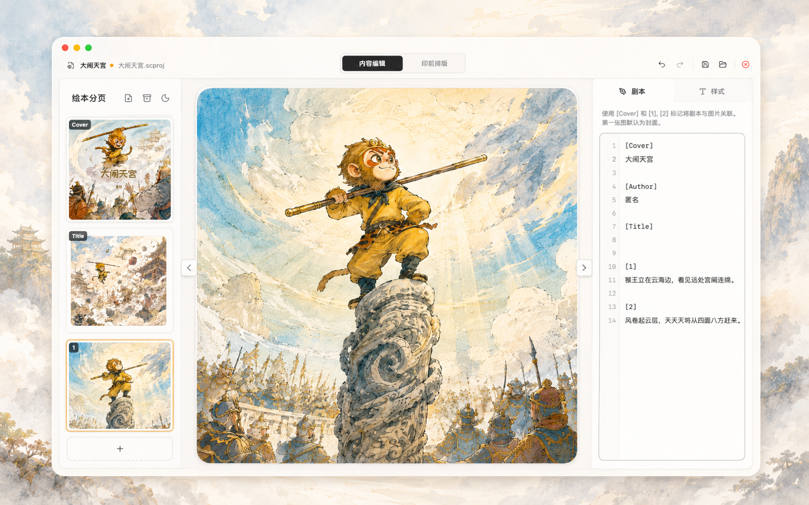
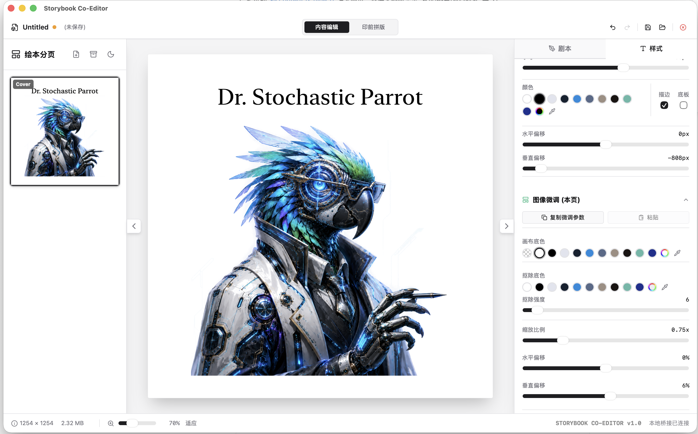
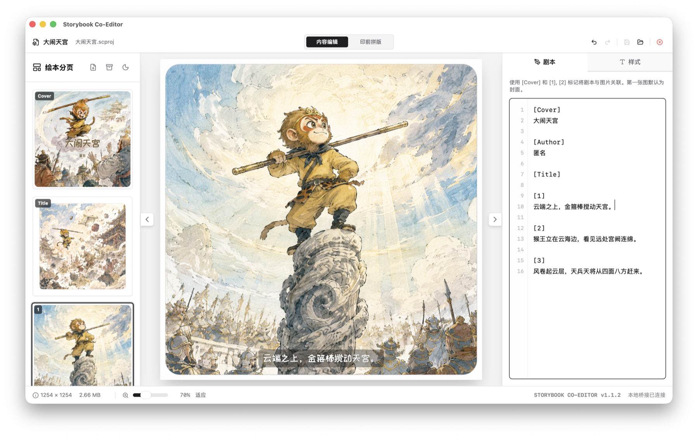
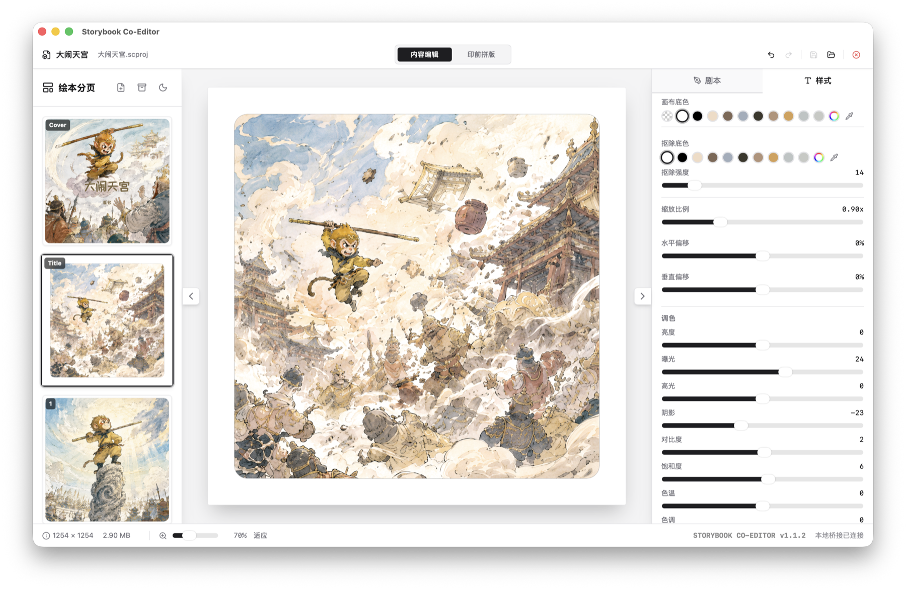
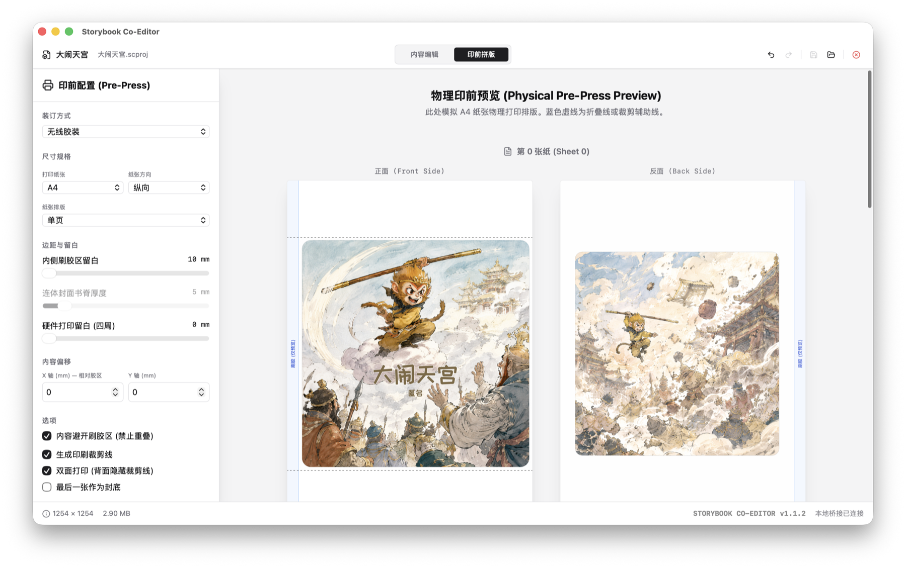
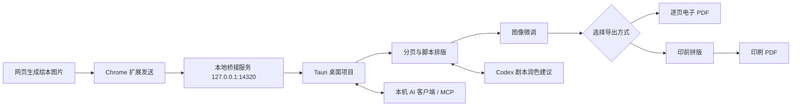

# Storybook Co-Editor

<p align="center">
  <strong>简体中文</strong> · <a href="./README.en.md">English</a>
</p>

<p align="center">
  
</p>

<p align="center">
  
  
  
  
  
</p>

Storybook Co-Editor 是一套面向 AI 绘本和网页绘本内容的本地协同排版工具。它把“网页生成图片”到“本地电子或印刷 PDF”的流程串起来：Chrome 扩展负责抓取插图，Tauri 桌面端负责分页、文字排版、图像微调、项目保存和印前拼版。

适合用 ChatGPT、Gemini、Midjourney、Discord 或其他网页工具生成绘本后，把图片整理成可编辑、可保存、可导出的本地项目。

- 当前版本：`1.2.1`
- 下载发布版：[GitLab Releases](https://gitlab.com/glenzli/storybook-co-editor/-/releases)
- 项目格式：`.scproj`
- 界面语言：简体中文、English
- 本地桥接：`http://127.0.0.1:14320`

## 预览

**Chrome 扩展：网页悬浮捕获**

在支持页面里悬停图片，直接发送到本地编辑器；也可以设为参考图，用于后续风格对齐。


**内容编辑：分页、封面、扉页、正文和文字样式**

左侧管理绘本页序，中间预览画布，右侧统一调整脚本、字体、字号、颜色、描边、底板和偏移。



**脚本编辑：用标签把文字绑定到页面**

在脚本面板里维护整本书的文字，`[Cover]`、`[Author]`、`[Title]` 和数字页会自动映射到对应页面预览。



**图像微调：针对单页做本地图像处理**

支持画布底色、指定底色抠除、缩放偏移、曝光、阴影、高光、饱和度、色温、色调和局部 HSL。



**印前拼版：面向实际打印的物理预览**

在 A4/A5/A3 等纸张上预览单页或双页拼版，配置装订方式、胶区留白、硬件边距、裁切线和双面打印。



## 核心流程



## 功能一览

**网页采集**

- 图片悬浮按钮：`发送`、`参考`。
- 支持从网页 DOM、懒加载图片、常见 AI 图片 URL 中提取图片。
- 图片以 base64 或 URL 方式发送到本地桌面端。
- 根据图片内容哈希去重，避免重复导入同一张图。

**本地绘本编辑**

- 左侧分页列表支持拖拽排序、置顶、置底、删除、恢复、复制和导出原图。
- 支持插入虚拟空白页 `blank://`，用于补齐印刷页数。
- 支持封面、扉页、正文、作者署名的独立样式。
- 脚本标签支持英文和中文：`[Cover]`、`[封面]`、`[Title]`、`[扉页]`、`[Author]`、`[作者]`、`[1]`、`[2]`。

**图像处理**

- 基础调色：亮度、曝光、对比度、高光、阴影、饱和度、色温、色调。
- 局部调色：按目标色相做 HSL 偏移，适合统一 AI 出图色彩。
- 背景处理：指定底色抠除，解决 AI 图片边缘泛白、泛黄或泛灰问题。
- 页面级微调：每页独立保存缩放、偏移、底色和图像参数。

**印前与导出**

- 支持骑马钉、无线胶装、蝴蝶对裱等常见装订方式。
- 支持 1-up / 2-up 拼版、正反面预览、裁切线、胶区留白和硬件边距。
- 支持按项目画布比例逐页导出电子 PDF，不包含拼版、裁切线和装订留白。
- 支持填写作品标题、参与者、版权与许可、ISBN、DOI、URL 等出版信息，并写入电子及印刷 PDF 的 Info 与 XMP metadata。
- 可按电子版或电子与印刷版生成版权页，版权页与故事页共用导出页序。
- 电子 PDF 提供屏幕发布、个人阅读和开放阅读预设，也可独立设置打印、复制、修改和批注权限。
- 受限电子 PDF 使用 PDF 2.0 AES-256 权限加密，可选打开密码；密码仅用于本次导出，不写入项目。
- 编辑预览、电子 PDF 和印刷 PDF 共用逻辑页面渲染规则。

**项目管理**

- `.scproj` 是 zip 项目包，包含 `project.json`、图片资源和回收站。
- 出版与版权信息、电子 PDF 权限偏好作为可选的项目级数据保存在 `.scproj` 中。
- 支持最近项目、保存、另存为、自动保存、撤销和重做。
- 桌面端支持简体中文和英文实时切换并记忆选择；Chrome 扩展跟随浏览器语言。
- 核心编辑与导出在本地完成；可选的 Codex 润色按 Codex 当前模型配置处理。

**AI 协作（实验性）**

- 工具栏的 AI 入口会显示带访问令牌的本机 MCP 地址，可直接生成 Codex 配置。
- 访问令牌由应用随机生成；可在 AI 入口轮换。轮换会立即使旧令牌失效，并需要用新的配置重新连接 Codex 或其他客户端。
- MCP 第一版支持读取当前项目和完整剧本、替换剧本、读取页面布局及调整单页文字位置。
- 所有 MCP 写入都要求携带最近一次读取到的 `last_modified`，检测到并发修改时会拒绝覆盖，并把成功修改实时同步回编辑器。
- 剧本面板提供 `Codex 润色`：执行前可以从本机 Codex 的可用模型中选择，并填写本次修改意见。Codex 只返回建议版本，应用会先显示原文与建议对照，确认后才写入项目。
- 润色功能复用本机 Codex 登录和模型配置；剧本文本与修改意见会发送给所选模型服务。未安装或未登录 Codex 时，普通编辑和 MCP 功能不受影响。

PDF 权限用于表达发布者的使用限制，不等同于 DRM；截图或专用工具仍可能绕过限制。项目不会保存 PDF 打开密码。

## 下载安装

从 [Releases](https://gitlab.com/glenzli/storybook-co-editor/-/releases) 下载对应版本：

```text
storybook-co-editor_1.2.1_aarch64.dmg
storybook-co-editor-extension-v1.2.1.zip
```

安装步骤：

1. 安装并打开 macOS 桌面端。
2. 解压 Chrome 扩展包。
3. 打开 `chrome://extensions`，启用开发者模式。
4. 选择解压后的扩展目录加载。
5. 保持桌面端打开，在网页图片上点击扩展浮层的 `发送`。

说明：

- 当前 macOS 包未做 Apple notarization。首次打开如遇安全提示，可在 Finder 中右键打开，或到系统设置中允许打开。

## 脚本文本格式

右侧脚本区按标签拆分文字并映射到页面：

```text
[Cover]
大闹天宫

[Author]
匿名

[Title]

[1]
云端之上，金箍棒搅动天宫。

[2]
猴王立在云海边，看见远处宫阙连绵。

[3]
风卷起云层，天兵天将从四面八方赶来。
```

规则：

- `[Cover]` 或 `[封面]` 映射第 0 页。
- `[Author]` 或 `[作者]` 映射封面作者署名。
- `[Title]` 或 `[扉页]` 映射扉页；如果存在扉页，正文数字页会自动后移。
- `[1]`、`[2]` 等数字标签映射正文页。

## 连接 AI 客户端

1. 打开一个项目，点击顶部工具栏的机器人图标。
2. 点击 `安装到 Codex` 并确认。应用只会在 Codex 用户配置（`~/.codex/config.toml`）中创建或更新 `storybook` 条目，保留其他设置；其他 AI 客户端仍可复制下方配置。
3. 重启 Codex 或新建一个任务，并在使用 `storybook` MCP 服务时保持 Storybook Co-Editor 运行。

MCP 服务只监听 `127.0.0.1:14320`，并使用首次启动时生成的本机令牌。令牌拥有当前项目的读取和编辑权限，不应写入仓库或交给不受信任的客户端；轮换令牌后需要重新安装 Codex 条目。图像像素不会作为 MCP 资源暴露；第一版只提供项目结构、剧本和少量排版参数。

## 本地开发

### 桌面端

```bash
cd app
pnpm install
pnpm tauri dev
```

桌面端启动后会开启本地服务：

```text
http://127.0.0.1:14320
```

### Chrome 扩展

```bash
cd extension
pnpm install
pnpm dev
```

然后在 Chrome 打开 `chrome://extensions`，启用开发者模式，选择 `extension/dist` 作为 unpacked extension 加载。

### 质量检查

提交前从仓库根目录运行：

```bash
./scripts/check.sh
```

该命令会检查架构边界、lint、TypeScript、前端测试与构建、扩展构建、Rust 格式和测试。模块职责、schema 同步规则及 `utils/` 棘轮见 [ARCHITECTURE.md](ARCHITECTURE.md)。

## 仓库结构

```text
.
├── app/                 # Tauri 桌面端：React 前端 + Rust 后端
│   ├── src/             # project、story、editor、print 语义 owner 与 UI
│   └── src-tauri/       # 项目契约、存储、归档和本地接收协议
├── extension/           # Chrome Manifest V3 扩展
│   ├── src/content.ts   # 网页注入层：图片浮层、发送、参考图
│   └── src/background.ts# 转发图片到本地桌面端
├── fixtures/            # TypeScript/Rust 共享数据契约
├── scripts/             # 本地与 CI 共用的质量检查
├── docs/images/         # README 截图资源
├── release/             # 本地构建产物输出目录
└── release.sh           # 手动 release 构建脚本
```

## 构建发布

根目录提供了一键构建脚本，会同时打包 Chrome 扩展和 macOS 桌面端，产物输出到 `release/`。

```bash
chmod +x release.sh
./release.sh
```

预期产物：

```text
release/storybook-co-editor.app
release/storybook-co-editor_1.2.1_aarch64.dmg
release/storybook-co-editor.app.zip
release/storybook-co-editor-extension-v1.2.1.zip
release/storybook-co-editor-licenses-v1.2.1.zip
release/SHA256SUMS.txt
release/RELEASE_NOTES_v1.2.1.md
```

详细手动发布流程见 [RELEASE.md](RELEASE.md)。

## 技术栈

- Desktop: Tauri 2, Rust, Axum, Tokio
- Frontend: React 19, Vite, TypeScript, Tailwind CSS
- Extension: Chrome Manifest V3, TypeScript, Vite
- Export: html2canvas, jsPDF, lopdf

## 许可证与第三方资源

Storybook Co-Editor 应用代码使用 MIT License。内置字体使用各自的 SIL Open Font License 1.1，完整文本会随源码和发布包分发，也可以在应用内的“许可与致谢”中查看。详见 [THIRD_PARTY_NOTICES.md](THIRD_PARTY_NOTICES.md)。
